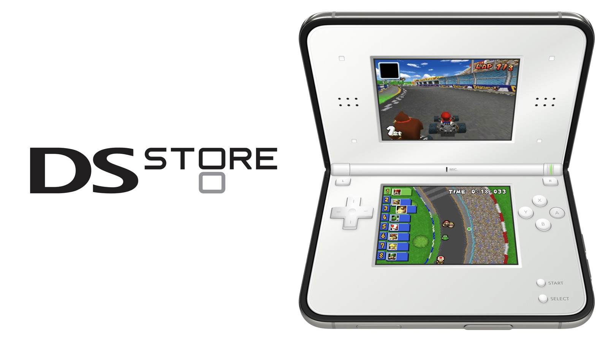

# DS Store

[](https://youtu.be/n9qt1C6v90o)

**[▶ Watch the demo video on YouTube](https://youtu.be/n9qt1C6v90o)**

A SwiftUI Nintendo DS app for iOS, built on [DeltaCore](https://github.com/rileytestut/DeltaCore) and [melonDS](https://melonds.kuribo64.net) (via [MelonDSDeltaCore](https://github.com/rileytestut/MelonDSDeltaCore)). It boots a single game bundled into the app.

## Requirements

- Xcode 27.1, expected at `/Applications/Xcode 27.1.app`. Set `XCODE_PATH` to use another location.
- [just](https://github.com/casey/just), [XcodeGen](https://github.com/yonaskolb/XcodeGen) and [jq](https://jqlang.org)

## Getting started

```sh
git clone --recursive <repo-url>
cd dsstore
just bootstrap            # fetch submodules, patch them, generate the Xcode project
just rom /path/to/game.nds
just run                  # build and launch on the simulator
```

Run `just` to list every recipe. To pick another simulator, pass `just simulator="iPhone 18 Pro" run`.

## Games

No games are included. Use a dump of a game you own; see [`ROM/README.md`](ROM/README.md).

## License

[GPLv3](LICENSE). DeltaCore, MelonDSDeltaCore and melonDS are under their own licenses.
